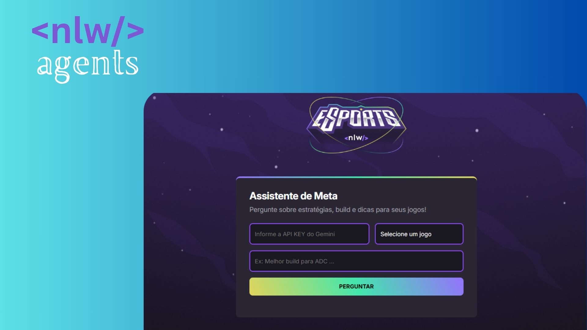

<h1 align="center"> 
NLW Agents </h1>

Programa exclusivo e gratuito, promovido pela Rocketseat para ensino de tecnologias WEB.  

  <a href="#-tecnologias">Tecnologias</a>&nbsp;&nbsp;&nbsp;|&nbsp;&nbsp;&nbsp;
  <a href="#-projeto">Projeto</a>&nbsp;&nbsp;&nbsp;|&nbsp;&nbsp;&nbsp;
  <a href="#memo-licença">Licença</a>

  

 

  

## 🚀 Tecnologias

Esse projeto foi desenvolvido com as seguintes tecnologias:

- HTML e CSS para a estrutura e o design da interface
- JavaScript para a lógica e integração com a API Gemini
- Git e Github para versionamento e hospedagem do código

## 💻 Projeto

O projeto Meta-Buddy é um assistente inteligente de jogos que responde perguntas sobre builds, estratégias e metas atualizadas usando IA integrada com a API Gemini.

- [Acesse o projeto finalizado, online](https://jvictorveloso.github.io/Projeto-Meta-Buddy/)

## :memo: Licença

Esse projeto está sob a licença MIT.

---

Feito por Victor Veloso

# HTML

- HypertText
  - Textos puros, livros, revistas, jornais;
  - Links: acessar outros documentos;
  - Imagens, vídeos, áudios;
- Markup
  - Marcação
  - Tags: <a> Link </a>
  - Atributos
  - Globais: id, class, ...
- Language
  - Linguagem
  - Sintaxe: maneira de escrever

# HTTP

- HyperText
- Transfer
  - Transferência
- Protocol
  - Protocolo
  - Conjunto de regras
- Methods HTTP (verbos): Get, Post, Patch/Put, Delete
- Headers (cabeçalhos): Instruções/Informações extras para cada chamada

# URL

- Uniform
  - Uniforme
- Resource
  - Recurso
- Locator - Localizador
  Encontrar um recurso (html, css, js, pdf, jpg, mp4, mpr, ...)
  Endereço

# IP

- Internet
  - Rede mundial de computadores
- Protocol
  - Conjunto de regras
    Endereço do computador
    rocketseat.com.br (domínio)
    123.32.1.23 (ip)

# DNS

- Domain
  - Domínio
- Name
  - Nome
- Server
  - Servidor

# CSS

- Cascading
  - Cascata
  - Regras das escritas
  - Hierarquia
  - Especificidade
- Style
  - Estilo
- Sheet
  - Folha

De um arquivo que terá na sua sintaxe, declarações, propriedades e valores.
A partir disso, o HTML é impactado visualmente.

- declaração
- seletor
- propriedade e valor

# JS

- Linguagem de programação
- Browsers
- Input -> Process -> Output
- Variáveis
- Function
  - Agrupamento e reuso de código
  - Sequencia lógica
  - Saída
- Gemini (IA): esperar uma resposta
- Mexer no meu navegador
- Estrutura de dados
- Estrutura de decisão
- Algoritmo: sequencia de passos lógica, de maneira ordenada, a fim de chegar a alguma conclusão (limitada)
- Lógica (Pensamento computacional)
  - Abstração
  - Decomposição
  - Algoritmo
  - Reconhecimento de padrão
- Tipos de dados
  - Number (números)
  - String (textos) (" ", ' ', ` `)
  - Boolean: true | false
  - Objects
  - ...

# DOM

- Document
- Object
- Model

# API

- Application
- Programming
- Interface
- JSON: JavaScript Object Notation

# CDN

- Content
- Delivery
- Network

# LLM

- Large
- Language
- Model
- Gemini, OpenAI (chatGPT), Anthropic (Claude) ...

# Agentes AI

- Tools (ferramentas): permitem uso de código, ou apps, ou qualquer informação extra.
- Melhor contexto

# Engenharia de prompt

- One shot: uma única pergunta sem muito contexto
- Few shot: é apresentado exemplos do que se espera
- Chain of Thought: Cadeia de pensamento para a IA responder gradativamente conforme a instrução.
